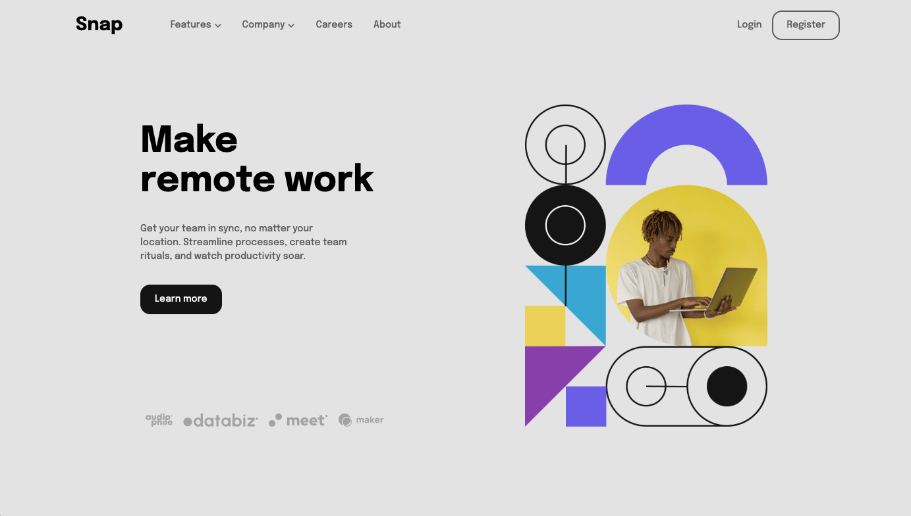
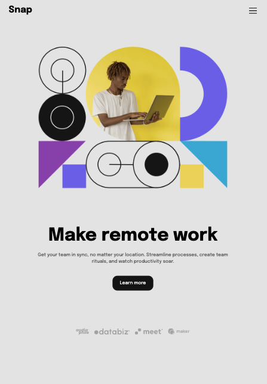

# Frontend Mentor - Intro section with dropdown navigation solution

This is a solution to the [Intro section with dropdown navigation challenge on Frontend Mentor](https://www.frontendmentor.io/challenges/intro-section-with-dropdown-navigation-ryaPetHE5). Frontend Mentor challenges help you improve your coding skills by building realistic projects.

## Table of contents

- [Overview](#overview)
  - [The challenge](#the-challenge)
  - [Screenshot](#screenshot)
  - [Links](#links)
- [My process](#my-process)
  - [Built with](#built-with)
  - [What I learned](#what-i-learned)
  - [Continued development](#continued-development)
  - [Useful resources](#useful-resources)
- [Author](#author)
- [Acknowledgments](#acknowledgments)

**Note: Delete this note and update the table of contents based on what sections you keep.**

## Overview

### The challenge

Users should be able to:

- View the relevant dropdown menus on desktop and mobile when interacting with the navigation links
- View the optimal layout for the content depending on their device's screen size
- See hover states for all interactive elements on the page

### Screenshot





### Links

- Solution URL: [solution URL](https://github.com/btebe/intro-dropdown-nav-site)
- Live Site URL: [live site URL](https://your-live-site-url.com)

## My process

### Built with

- Semantic HTML5 markup
- CSS custom properties
- Flexbox
- CSS Grid
- Mobile-first workflow
- [React](https://reactjs.org/) - JS library

### What I learned

I leanrned how to create custom dropdown menus.

To see how you can add code snippets, see below:

```js
{
  dropdownZero && (
    <>
      <ul
        className={
          dropdownZero
            ? "dropdown-menu menu-1 drop-indicator  active"
            : "dropdown-menu"
        }
      >
        <li>
           list
        </li>
        <li>
          
          Calendar
        </li>
        <li>
          
          Reminders
        </li>
        <li>
          
          Planning
        </li>
      </ul>
    </>
  );
}
```

### Continued development

I would like to be more efficient in creating page layouts.

### Useful resources

- [Example resource 1](https://www.youtube.com/watch?v=T2MhVxJxsL0&t=114s) - This video helped me create a dropdown menu

## Author

- Website - [Basma Tebe](https://basma94tebe.wixsite.com/my-site)
- Frontend Mentor - [@btebe](https://www.frontendmentor.io/profile/btebe)

## Acknowledgments

I would like to acknowledge Brian design for making a how to create Dropdown menu on react video and posting it on Youtube. It really helped me alot.
